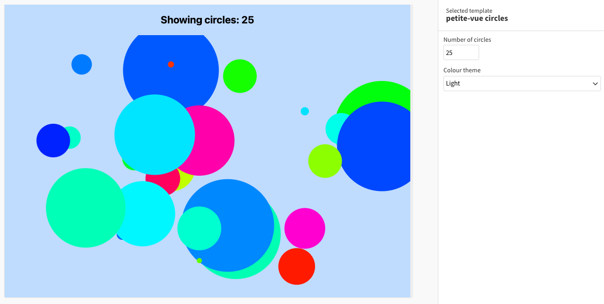

# Example Flourish template using petite-vue

This simple example uses petite-vue to draw a specified number of colorful circles at random positions, radii & colors. It demonstrates the use of settings in a petite-vue context.

## How this works

- `template.yml` has settings for the number of circles and theme
- `template.js` sets up the data and state objects as well as the draw and update functions, all of which are required to run a Flourish template
- In `index.html`, an SVG is drawn with the specified theme and the specified number of circles with randomized positions, radii & colors

## How to run this

- [Install Flourish](https://flourish.studio/developers/) and use `flourish run` to run the template
- More info about publishing a template to Flourish [can be found here](https://flourish.studio/developers/quickstart/publish-to-flourish/)